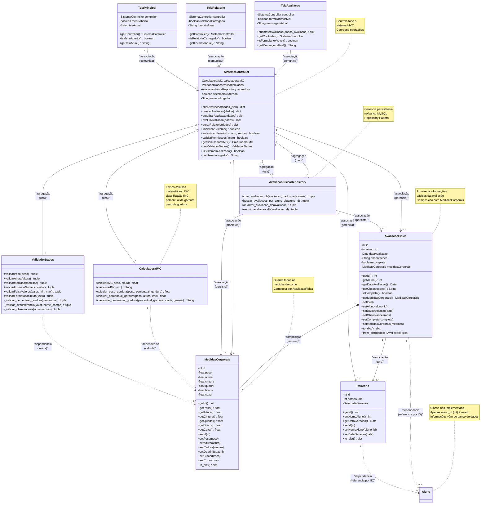

# Diagrama de Classes - Módulo Registro de Evolução Física (Arquitetura MVC)

## Diagrama de Classes - Arquitetura MVC

```mermaid
classDiagram
    %% ===== DADOS (MODEL) =====
    %% Aqui ficam as informações que o sistema guarda
    
    %% Estilo para classe Aluno (cor vermelha - não implementada)
    classDef alunoClass fill:#ff6b6b,stroke:#d63031,stroke-width:2px,color:#fff
    
    class AvaliacaoFisica {
        -int id
        -int aluno_id
        -Date dataAvaliacao
        -String observacoes
        -boolean completa
        -MedidasCorporais medidasCorporais
        +getId() int
        +getAluno() int
        +getDataAvaliacao() Date
        +getObservacoes() String
        +isCompleta() boolean
        +getMedidasCorporais() MedidasCorporais
        +setId(id)
        +setAluno(aluno_id)
        +setDataAvaliacao(data)
        +setObservacoes(obs)
        +setCompleta(completa)
        +setMedidasCorporais(medidas)
        +to_dict() dict
        +from_dict(dados)$ AvaliacaoFisica
    }

    class Aluno {
        %% Classe não implementada - apenas aluno_id é usado
    }
    

    class MedidasCorporais {
        -int id
        -float peso
        -float altura
        -float cintura
        -float quadril
        -float braco
        -float coxa
        +getId() int
        +getPeso() float
        +getAltura() float
        +getCintura() float
        +getQuadril() float
        +getBraco() float
        +getCoxa() float
        +setId(id)
        +setPeso(peso)
        +setAltura(altura)
        +setCintura(cintura)
        +setQuadril(quadril)
        +setBraco(braco)
        +setCoxa(coxa)
        +to_dict() dict
    }

    class Relatorio {
        -int id
        -int nomeAluno
        -Date dataGeracao
        +getId() int
        +getNomeAluno() int
        +getDataGeracao() Date
        +setId(id)
        +setNomeAluno(aluno_id)
        +setDataGeracao(data)
        +to_dict() dict
    }

    %% ===== LÓGICA DE NEGÓCIO (SERVICES) =====
    %% Aqui ficam os cálculos e validações
    
    class CalculadoraIMC {
        +calcularIMC(peso, altura) float
        +classificarIMC(imc) String
        +calcular_peso_gordura(peso, percentual_gordura) float
        +calcular_percentual_gordura(peso, altura, imc) float
        +classificar_percentual_gordura(percentual_gordura, idade, genero) String
    }

    class ValidadorDados {
        +validarPeso(peso) tuple
        +validarAltura(altura) tuple
        +validarMedidas(medidas) tuple
        +validarFormatoNumerico(valor) tuple
        +validarFaixaValores(valor, min, max) tuple
        +validarFormatacaoTexto(texto) tuple
        -_validar_percentual_gordura(percentual) tuple
        -_validar_circunferencia(valor, nome_campo) tuple
        -_validar_observacoes(observacoes) tuple
    }

    %% ===== CONTROLE (CONTROLLER) =====
    %% Aqui ficam as operações principais
    
    class SistemaController {
        -CalculadoraIMC calculadoraIMC
        -ValidadorDados validadorDados
        -AvaliacaoFisicaRepository repository
        -boolean sistemaInicializado
        -String usuarioLogado
        +criarAvaliacao(dados_json) dict
        +buscarAvaliacao(dados) dict
        +atualizarAvaliacao(dados) dict
        +excluirAvaliacao(dados) dict
        +gerarRelatorio(dados) dict
        +inicializarSistema() boolean
        +autenticarUsuario(usuario, senha) boolean
        +validarPermissoes(acao) boolean
        +getCalculadoraIMC() CalculadoraIMC
        +getValidadorDados() ValidadorDados
        +isSistemaInicializado() boolean
        +getUsuarioLogado() String
    }

    %% ===== PERSISTÊNCIA (REPOSITORY) =====
    %% Aqui ficam as operações de banco de dados
    
    class AvaliacaoFisicaRepository {
        +criar_avaliacao_db(avaliacao, dados_adicionais) tuple
        +buscar_avaliacoes_por_aluno_db(aluno_id) tuple
        +atualizar_avaliacao_db(avaliacao) tuple
        +excluir_avaliacao_db(avaliacao_id) tuple
    }

    %% ===== INTERFACE (VIEW) =====
    %% Aqui ficam as telas que o usuário vê
    
    class TelaAvaliacao {
        -SistemaController controller
        -boolean formularioVisivel
        -String mensagemAtual
        +submeterAvaliacao(dados_avaliacao) dict
        +getController() SistemaController
        +isFormularioVisivel() boolean
        +getMensagemAtual() String
    }

    class TelaRelatorio {
        -SistemaController controller
        -boolean relatorioCarregado
        -String formatoAtual
        +getController() SistemaController
        +isRelatorioCarregado() boolean
        +getFormatoAtual() String
    }

    class TelaPrincipal {
        -SistemaController controller
        -boolean menuAberto
        -String telaAtual
        +getController() SistemaController
        +isMenuAberto() boolean
        +getTelaAtual() String
    }

    %% ===== RELACIONAMENTOS MVC COM CARDINALIDADES =====
    
    %% Relacionamentos de COMPOSIÇÃO (Composição - forte dependência)
    %% Uma AvaliacaoFisica É COMPOSTA POR MedidasCorporais
    AvaliacaoFisica "1" *-- "1" MedidasCorporais : "composição<br/>(tem-um)"
    
    %% Relacionamentos de AGREGAÇÃO (Agregação - dependência média)
    %% Services podem existir independentemente do Controller
    SistemaController "1" o-- "1" CalculadoraIMC : "agregação<br/>(usa)"
    SistemaController "1" o-- "1" ValidadorDados : "agregação<br/>(usa)"
    SistemaController "1" o-- "1" AvaliacaoFisicaRepository : "agregação<br/>(usa)"
    
    %% Relacionamentos de ASSOCIAÇÃO (Associação - relacionamento fraco)
    %% Relatorio pode existir independentemente de AvaliacaoFisica
    AvaliacaoFisica "1" --> "0..*" Relatorio : "associação<br/>(gera)"
    
    %% Relacionamentos Aluno (Agregação)
    %% NOTA: Aluno não é implementado - apenas aluno_id (int) é usado
    %% AvaliacaoFisica armazena apenas aluno_id (int), não objeto Aluno
    AvaliacaoFisica "1" ..> "0..1" Aluno : "dependência<br/>(referencia por ID)"
    Relatorio "1" ..> "0..1" Aluno : "dependência<br/>(referencia por ID)"
    
    %% Relacionamentos Controller -> Model (Associações)
    %% Controller gerencia mas não possui os modelos
    SistemaController "1" --> "0..*" AvaliacaoFisica : "associação<br/>(gerencia)"
    SistemaController "1" --> "0..*" MedidasCorporais : "associação<br/>(manipula)"
    SistemaController "1" --> "0..*" Relatorio : "associação<br/>(gerencia)"
    
    %% Relacionamentos Controller -> Repository (Agregação)
    %% Controller usa Repository para persistência
    SistemaController "1" o-- "1" AvaliacaoFisicaRepository : "agregação<br/>(usa)"
    
    %% Relacionamentos Repository -> Model (Associações)
    %% Repository trabalha com modelos para persistência
    AvaliacaoFisicaRepository "1" --> "0..*" AvaliacaoFisica : "associação<br/>(persiste)"
    AvaliacaoFisicaRepository "1" --> "0..*" MedidasCorporais : "associação<br/>(persiste)"
    
    %% Relacionamentos View -> Controller (Associações)
    %% Views dependem do Controller para funcionar
    TelaAvaliacao "1" --> "1" SistemaController : "associação<br/>(comunica)"
    TelaRelatorio "1" --> "1" SistemaController : "associação<br/>(comunica)"
    TelaPrincipal "1" --> "1" SistemaController : "associação<br/>(comunica)"
    
    %% Relacionamentos Service -> Model (Dependências)
    %% Services dependem temporariamente dos modelos
    CalculadoraIMC "1" ..> "0..*" MedidasCorporais : "dependência<br/>(calcula)"
    ValidadorDados "1" ..> "0..*" MedidasCorporais : "dependência<br/>(valida)"

    %% Notas explicativas
    note for Aluno "Classe não implementada<br/>Apenas aluno_id (int) é usado<br/>Informações vêm do banco de dados"
    
    note for AvaliacaoFisica "Armazena informações<br/>básicas da avaliação<br/>Composição com MedidasCorporais"
    
    note for MedidasCorporais "Guarda todas as<br/>medidas do corpo<br/>Composta por AvaliacaoFisica"
    
    note for CalculadoraIMC "Faz os cálculos<br/>matemáticos: IMC,<br/>classificação IMC,<br/>percentual de gordura,<br/>peso de gordura"
    
    note for SistemaController "Controla todo o<br/>sistema MVC<br/>Coordena operações"
    
    note for AvaliacaoFisicaRepository "Gerencia persistência<br/>no banco MySQL<br/>Repository Pattern"
```

