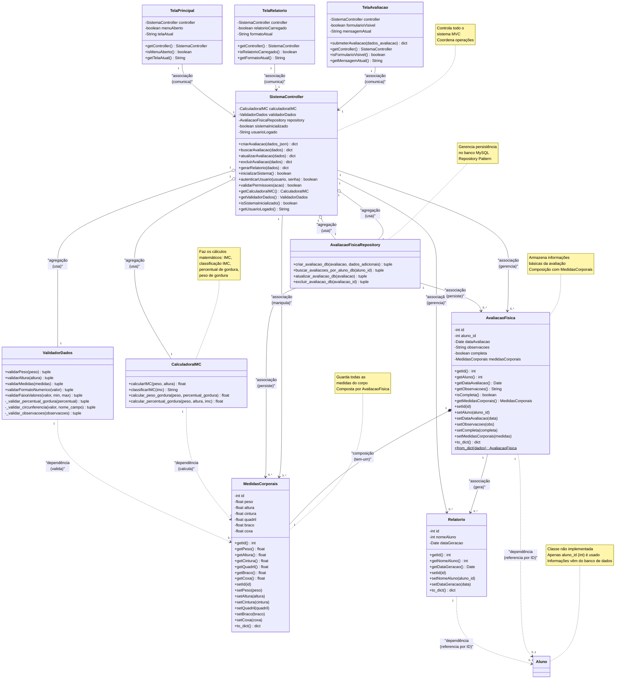

# Diagrama de Classes - Módulo Registro de Evolução Física (Arquitetura MVC)

## Diagrama de Classes - Arquitetura MVC

## Arquitetura MVC - Descrição das Camadas

### **CAMADA MODEL (MODELOS + SERVIÇOS + REPOSITÓRIOS)**

### 🗂️ **DADOS (Model)**
São como "gavetas" onde guardamos as informações:
- **AvaliacaoFisica**: Guarda informações básicas (aluno_id, data, observações, completa). Tem composição 1:1 com MedidasCorporais.
- **MedidasCorporais**: Guarda todas as medidas do corpo (peso, altura, cintura, quadril, braco, coxa). É composta por AvaliacaoFisica.
- **Relatorio**: Guarda informações dos relatórios gerados (id, nomeAluno como ID, dataGeracao).
- **Aluno**: Classe não implementada - apenas aluno_id (int) é usado. Informações completas vêm do banco de dados.

### ⚙️ **LÓGICA DE NEGÓCIO (Services)**
São como "calculadoras inteligentes" que fazem os cálculos:

- **CalculadoraIMC**: 
  - Calcula o IMC (Índice de Massa Corporal)
  - Classifica o IMC em categorias da OMS
  - Calcula percentual de gordura (fórmula Deurenberg simplificada: (1.20 * imc) - 5.4)
  - Calcula peso de gordura

- **ValidadorDados**: 
  - Valida peso (20-180 kg)
  - Valida altura (1.00-2.50 m)
  - Valida medidas completas
  - Valida formato numérico
  - Valida faixa de valores
  - Métodos privados para validações internas (percentual gordura, circunferências, observações)

### 🎮 **CONTROLE (Controller)**
É como um "gerente geral" que coordena tudo:

- **SistemaController**: 
  - Controla todo o sistema - avaliações, relatórios, autenticação
  - Coordena operações entre Services, Models e Repository
  - Implementa padrão Facade
  - Gerencia estado do sistema (inicialização, usuário logado)
  - Métodos principais: criarAvaliacao, buscarAvaliacao, atualizarAvaliacao, excluirAvaliacao, gerarRelatorio

### 💾 **PERSISTÊNCIA (Repository)**
Gerencia acesso ao banco de dados:

- **AvaliacaoFisicaRepository**: 
  - Implementa padrão Repository Pattern
  - Separa lógica de persistência do modelo de domínio
  - Operações CRUD: criar, buscar, atualizar, excluir avaliações
  - Converte objetos para/do banco de dados
  - Usa função `get_db_connection()` do `app.py` (importação local para evitar dependência circular)

### 🖥️ **INTERFACE (View)**
São as telas que o usuário vê e usa:

- **TelaAvaliacao**: 
  - Tela para preencher dados da avaliação
  - Submete avaliação através do controller
  - Gerencia estado básico (formulário visível, mensagem atual)
  - **Nota**: Métodos de exibição foram removidos (lógica está no frontend)

- **TelaRelatorio**: 
  - Tela para ver relatórios
  - Gerencia estado básico (relatório carregado, formato atual)
  - **Nota**: Métodos de exibição e exportação foram removidos (lógica está no frontend)

- **TelaPrincipal**: 
  - Tela principal com menu, dashboard e navegação
  - Gerencia estado básico (menu aberto, tela atual)
  - **Nota**: Métodos de exibição e navegação foram removidos (lógica está no frontend)

## Como Funciona na Prática?

1. **Usuário** acessa o sistema através da **TelaPrincipal**
2. **TelaPrincipal** comunica com o **SistemaController** para autenticação
3. **SistemaController** valida permissões e coordena acesso
4. **SistemaController** busca dados do aluno no banco via **AvaliacaoFisicaRepository** (aluno_id é usado, classe Aluno não implementada)
5. **Usuário** preenche dados na **TelaAvaliacao**
6. **TelaAvaliacao** envia dados para o **SistemaController**
7. **SistemaController** pede para o **ValidadorDados** verificar se está tudo certo
8. **SistemaController** pede para o **CalculadoraIMC** calcular o IMC e percentual de gordura
9. **SistemaController** cria objetos **AvaliacaoFisica** e **MedidasCorporais**
10. **SistemaController** salva os dados via **AvaliacaoFisicaRepository** no banco MySQL
11. **SistemaController** avisa a **TelaAvaliacao** que deu tudo certo
12. **TelaRelatorio** solicita relatório ao **SistemaController**
13. **SistemaController** busca avaliações via **AvaliacaoFisicaRepository**
14. **SistemaController** gera **Relatorio** baseado nos dados salvos
15. **TelaRelatorio** exibe relatório formatado

## 📊 Tabela de Relacionamentos de Classes e Cardinalidades

### **Resumo Completo dos Relacionamentos**

| Classe Origem | Relacionamento | Classe Destino | Cardinalidade | Tipo | Descrição |
|---------------|----------------|----------------|---------------|------|-----------|
| **AvaliacaoFisica** | `*--` | **MedidasCorporais** | 1:1 | COMPOSIÇÃO | Uma avaliação É COMPOSTA POR uma medida corporal |
| **AvaliacaoFisica** | `..>` | **Aluno** | 1:0..1 | DEPENDÊNCIA | Uma avaliação referencia aluno por ID (classe não implementada) |
| **AvaliacaoFisica** | `-->` | **Relatorio** | 1:N | ASSOCIAÇÃO | Uma avaliação GERA zero ou muitos relatórios |
| **Relatorio** | `..>` | **Aluno** | 1:0..1 | DEPENDÊNCIA | Um relatório referencia aluno por ID (classe não implementada) |
| **SistemaController** | `o--` | **CalculadoraIMC** | 1:1 | AGREGAÇÃO | Um controller USA uma calculadora |
| **SistemaController** | `o--` | **ValidadorDados** | 1:1 | AGREGAÇÃO | Um controller USA um validador |
| **SistemaController** | `o--` | **AvaliacaoFisicaRepository** | 1:1 | AGREGAÇÃO | Um controller USA um repositório |
| **SistemaController** | `-->` | **AvaliacaoFisica** | 1:N | ASSOCIAÇÃO | Um controller GERENCIA zero ou muitas avaliações |
| **SistemaController** | `-->` | **MedidasCorporais** | 1:N | ASSOCIAÇÃO | Um controller MANIPULA zero ou muitas medidas |
| **SistemaController** | `-->` | **Relatorio** | 1:N | ASSOCIAÇÃO | Um controller GERENCIA zero ou muitos relatórios |
| **AvaliacaoFisicaRepository** | `-->` | **AvaliacaoFisica** | 1:N | ASSOCIAÇÃO | Um repositório PERSISTE zero ou muitas avaliações |
| **AvaliacaoFisicaRepository** | `-->` | **MedidasCorporais** | 1:N | ASSOCIAÇÃO | Um repositório PERSISTE zero ou muitas medidas |
| **TelaAvaliacao** | `-->` | **SistemaController** | 1:1 | ASSOCIAÇÃO | Uma tela COMUNICA com um controller |
| **TelaRelatorio** | `-->` | **SistemaController** | 1:1 | ASSOCIAÇÃO | Uma tela COMUNICA com um controller |
| **TelaPrincipal** | `-->` | **SistemaController** | 1:1 | ASSOCIAÇÃO | Uma tela COMUNICA com um controller |
| **CalculadoraIMC** | `..>` | **MedidasCorporais** | 1:N | DEPENDÊNCIA | Uma calculadora CALCULA zero ou muitas medidas |
| **ValidadorDados** | `..>` | **MedidasCorporais** | 1:N | DEPENDÊNCIA | Um validador VALIDA zero ou muitas medidas |

## Métodos Principais por Classe

### **AvaliacaoFisica**
- Getters: `getId()`, `getAluno()`, `getDataAvaliacao()`, `getObservacoes()`, `isCompleta()`, `getMedidasCorporais()`
- Setters: `setId()`, `setAluno()`, `setDataAvaliacao()`, `setObservacoes()`, `setCompleta()`, `setMedidasCorporais()`
- Auxiliares: `to_dict()`, `from_dict()` (classmethod)

### **MedidasCorporais**
- Getters: `getId()`, `getPeso()`, `getAltura()`, `getCintura()`, `getQuadril()`, `getBraco()`, `getCoxa()`
- Setters: `setId()`, `setPeso()`, `setAltura()`, `setCintura()`, `setQuadril()`, `setBraco()`, `setCoxa()`
- Auxiliares: `to_dict()`

### **Relatorio**
- Getters: `getId()`, `getNomeAluno()`, `getDataGeracao()`
- Setters: `setId()`, `setNomeAluno()`, `setDataGeracao()`
- Auxiliares: `to_dict()`

### **CalculadoraIMC**
- Cálculos: `calcularIMC()`, `classificarIMC()`, `calcular_peso_gordura()`, `calcular_percentual_gordura()`

### **ValidadorDados**
- Validações públicas: `validarPeso()`, `validarAltura()`, `validarMedidas()`, `validarFormatoNumerico()`, `validarFaixaValores()`
- Validações privadas: `_validar_percentual_gordura()`, `_validar_circunferencia()`, `_validar_observacoes()`

### **SistemaController**
- CRUD Avaliações: `criarAvaliacao()`, `buscarAvaliacao()`, `atualizarAvaliacao()`, `excluirAvaliacao()`
- Relatórios: `gerarRelatorio()`
- Sistema: `inicializarSistema()`, `autenticarUsuario()`, `validarPermissoes()`
- Getters: `getCalculadoraIMC()`, `getValidadorDados()`, `isSistemaInicializado()`, `getUsuarioLogado()`

### **AvaliacaoFisicaRepository**
- CRUD: `criar_avaliacao_db()`, `buscar_avaliacoes_por_aluno_db()`, `atualizar_avaliacao_db()`, `excluir_avaliacao_db()`

### **TelaAvaliacao**
- Integração: `submeterAvaliacao()`
- Getters: `getController()`, `isFormularioVisivel()`, `getMensagemAtual()`

### **TelaRelatorio**
- Getters: `getController()`, `isRelatorioCarregado()`, `getFormatoAtual()`

### **TelaPrincipal**
- Getters: `getController()`, `isMenuAberto()`, `getTelaAtual()`

## Observações Importantes

1. **Classe Aluno**: Não é implementada. Apenas `aluno_id` (int) é usado. Informações completas do aluno vêm do banco de dados via JOIN.

2. **Composição**: `AvaliacaoFisica` tem composição 1:1 com `MedidasCorporais` - uma avaliação É COMPOSTA POR medidas corporais.

3. **Repository Pattern**: `AvaliacaoFisicaRepository` separa lógica de persistência do modelo de domínio.

4. **Facade Pattern**: `SistemaController` atua como Facade, simplificando a interface complexa do sistema.

5. **Encapsulamento**: Todos os atributos são privados (prefixo `_`). Acesso via getters e setters.

6. **Métodos Auxiliares**: Classes Model têm métodos `to_dict()` e `from_dict()` para serialização.

7. **Cálculos no Backend**: IMC e percentual de gordura são calculados no backend, não no frontend. O percentual de gordura usa a fórmula simplificada de Deurenberg: (1.20 * imc) - 5.4, com limites entre 3% e 70%.

8. **Simplificações Realizadas**: 
    - **ValidadorDados**: Removidos métodos duplicados (aliases em snake_case). Mantidos apenas métodos em camelCase.
    - **SistemaController**: Removidos métodos não utilizados (`coordenarOperacoes()`, `exportarPDF()`, `registrar_nova_avaliacao()`, `obter_historico_aluno()`).
    - **AvaliacaoFisica**: Removido método duplicado `getNomeAluno()`. Mantido apenas `getAluno()` e `setAluno()`.
    - **Views**: Removidos métodos não utilizados das classes TelaAvaliacao, TelaPrincipal e TelaRelatorio (lógica de interface está no frontend).

9. **Validações**: ValidadorDados tem métodos privados para validações internas (prefixo `_`).

10. **Conexão com Banco de Dados**: A função `get_db_connection()` está centralizada no arquivo `app.py`. O `AvaliacaoFisicaRepository` importa essa função localmente para evitar dependência circular.

11. **Código Simplificado**: O código foi simplificado para facilitar o aprendizado de estudantes, removendo duplicações e métodos não utilizados, mantendo todas as funcionalidades principais.
